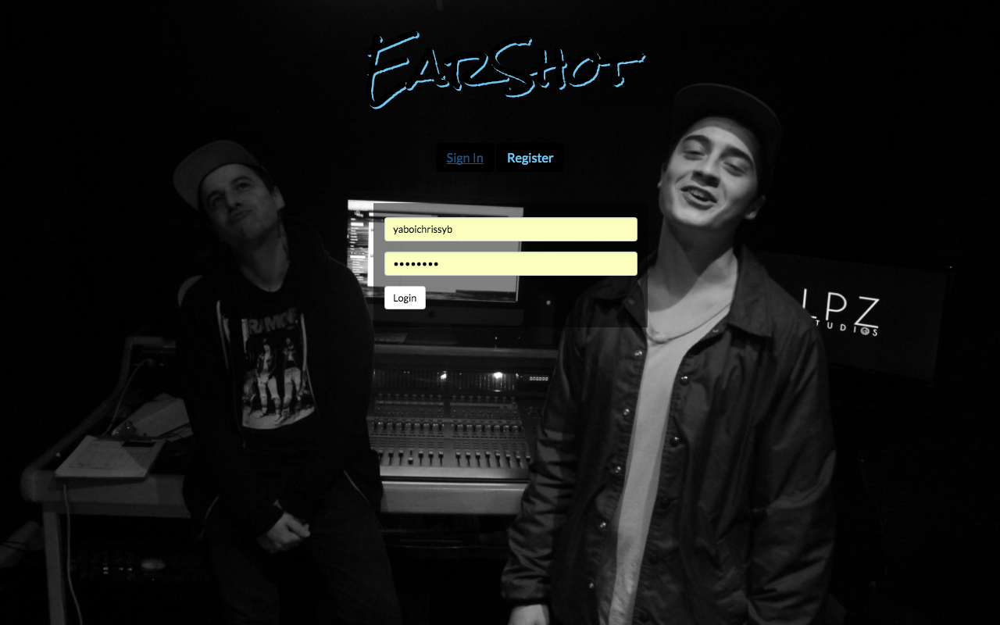
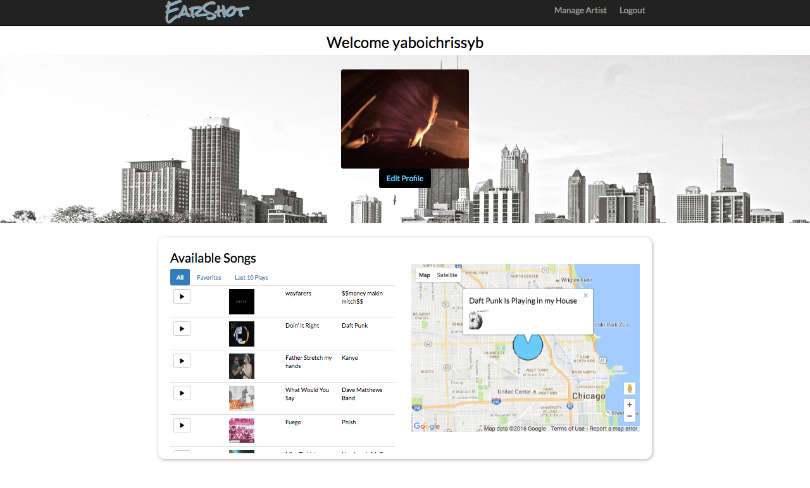
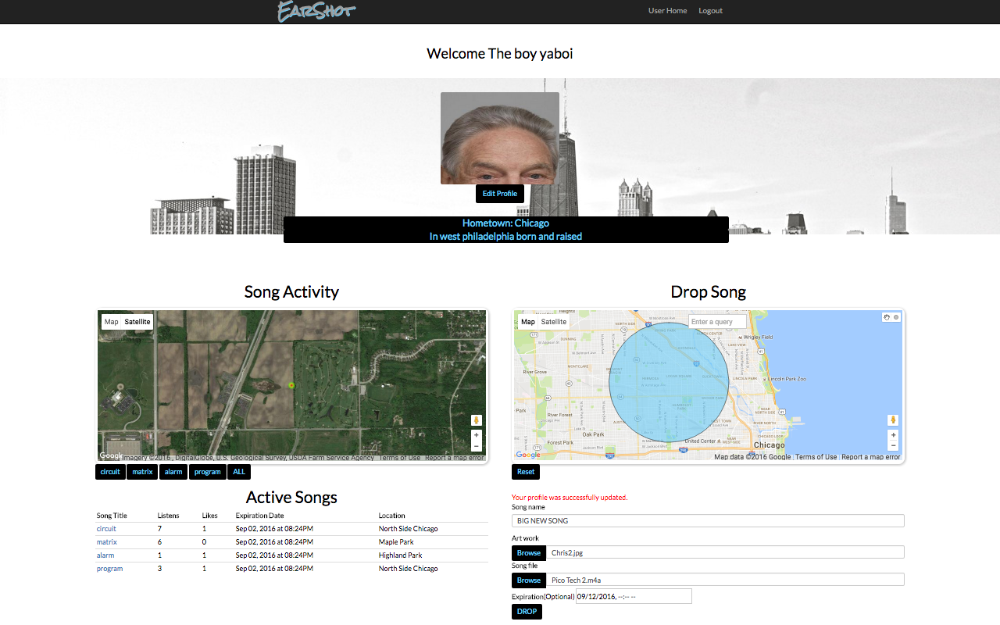
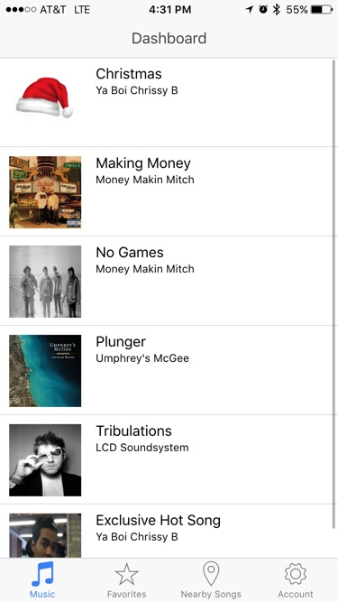
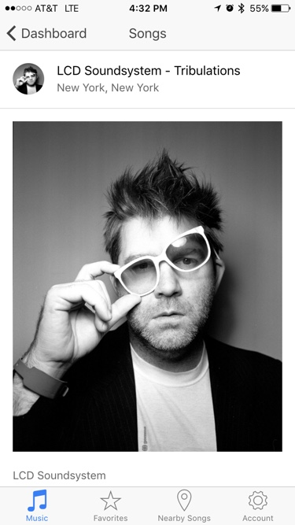
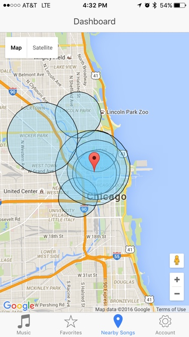

# Earshot

A location-based music streaming app.  Earshot allows users to discover exclusive local music.  It allows artists to connect with nearby audiences, promote special events, and give back to their communities.  Artists can upload a song through the web platform by selecting a location with a radius of up to 5km by simply clicking and dragging on an embedded Google map.  If users are within the selected radius, the song will become available in their mobile app.

Earshot was conceived as a creative way to share music, a guerilla marketing tool for artists, and a tool for bringing back the intimacy, self-ownership, and pride in local music that web-based music sharing platforms continue to deteriorate.

This app was built in 7 days as a final project of [DevBootcamp](https://devbootcamp.com)'s 2016 Chicago Sea Lions.  We hope this app serves as a proof of concept and that similar technologies may be integrated with previously established services such as SoundCloud, Spotify or Apple Music. There is still much work to do on this app so we've decided to keep the repository private, but would still like to display the work we have thus far. Check it out on [Heroku](https://evening-gorge-29235.herokuapp.com), or take a look at the photos below.

## Web Overview

Earshot was conceived as a two-tier web and mobile application; with the web portion serving primarily to upload, manage, and track music. The user starts by registering and creating a new artist profile.  The artist is then free to upload a new audio file.

After logging in or registering, the user is taken to their main user page.  From here, they can see and listen to all songs available to them based on their current location.  They can also see their favorites list and last ten plays as well as a clickable map showing nearby songs.

From here, the user navigates to their artist profile where they are able to drop new songs and track the progress of previously released songs.

The artist uploads the audio file, artwork, an expiration date, and song information, along with a locational parameter generated by drawing on an embedded google maps.  This song is now available for streaming on the mobile app from anywhere within the specified location.

## Mobile Overview

When a user logs into the mobile app, they are taken to their dashboard.  Here they can view all available songs based on their current location.  Each time a user logs in, their streamable songs may change based on where they are at the time.

From here, they can of course select any available song for streaming.  On the song page they are shown basic song and artist information and are given the option to favorite the song for later.

If they select the nearby songs icon, they can view the location paramaters and basic info of nearby songs.

## Stack

Earshot's backend was created as a custom Rails API and served on the mobile front end with Ionic and web front end as a Rails web app. The app made extensive use of the Google Maps API embedded Javascript map, drawing, and heat maps plug-ins as well as Amazon Web Services and CloudFront for storage and streaming, and Geocoder for web-based location services.

## Team

This project was completed with a team of five DevBootcamp students.
<table>
  <thead><tr>
<td><a href='https://github.com/yaboichrissyb'>Chris Bunkers</a></td><td><a href='https://github.com/byronbenjamin'>Byron Gage</a></td><td><a href='https://github.com/creaumond'>Connor Reaumond</a></td></tr></thead>

<tr>
<td></td>
<td></td><td></td>
</tr>
<tr>
 <td><a href='https://github.com/kromitj'>Mitch Kroska
</a></td><td><a href='https://github.com/scottjoseph'>Joseph Scott</a></td></tr>
<tr><td></td><td><td>
</tr>
</table>